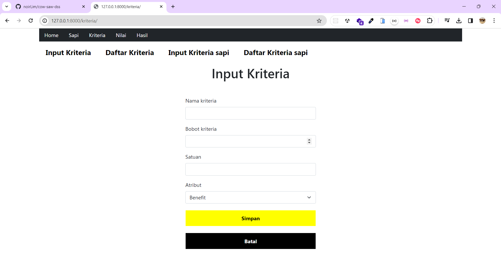
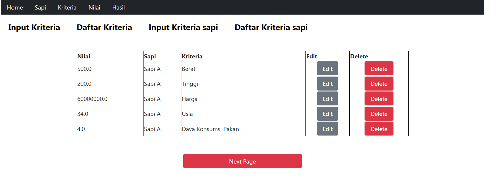
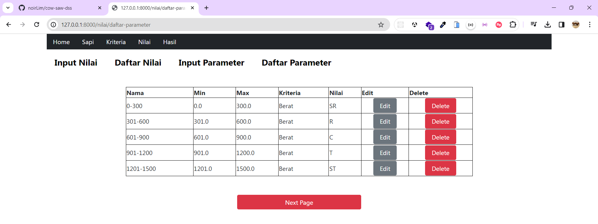
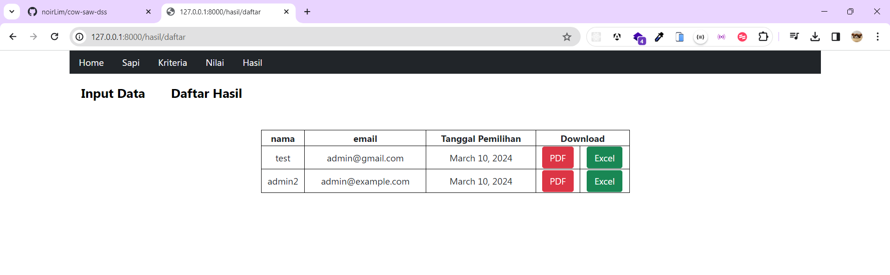
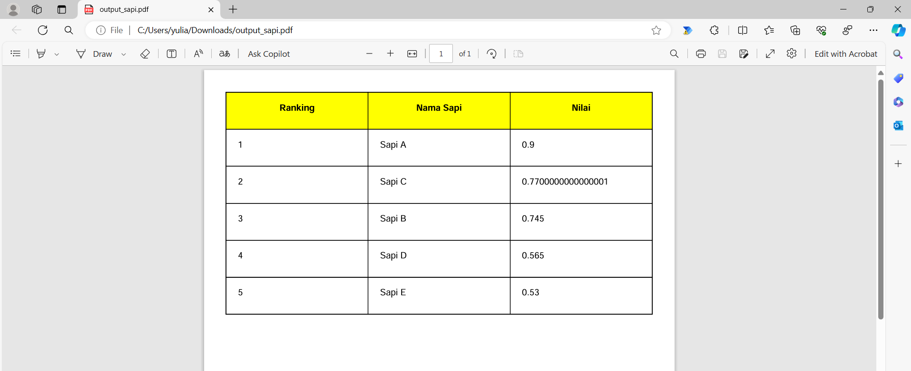
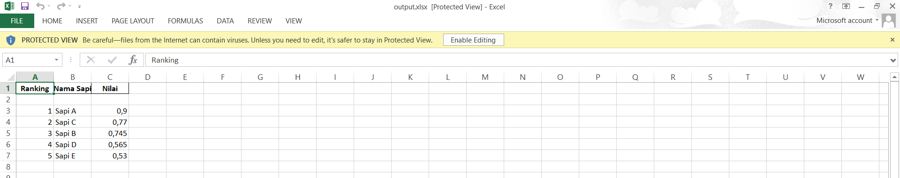

# Decision Support System For Selecting The Best Cow using Simple Additive Weighting Method

A decision support system in choosing the best cow using the web-based SAW method and using the django framework

# Utilites 
1. Programming Language: Python
2. Framework : Django
3. Database : PostgreSQL

# Features
1. Performing CRUD for criteria,cow and etc.
2. Perform criteria calculations on each cow using SAW build from several unit test.
3. Printing result in pdf and excel format.

# images
<figure style="margin-bottom:20px;">
  
  <figcaption>Criteria Input Form</figcaption>
</figure>

<figure>
  
  <figcaption>Cow Criteria Form</figcaption>
</figure>

<figure>
  
  <figcaption>Parameter Form</figcaption>
</figure>

<figure>
  
  <figcaption>Print Report List</figcaption>
</figure>

<figure>
  
  <figcaption>PDF Results</figcaption>
</figure>

<figure>
  
  <figcaption>Excel Results</figcaption>
</figure>
